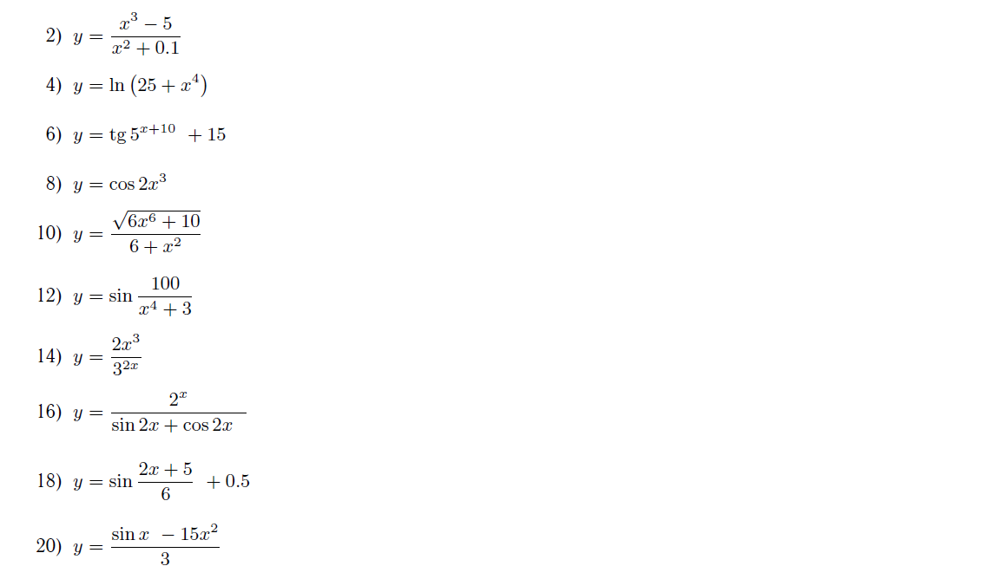
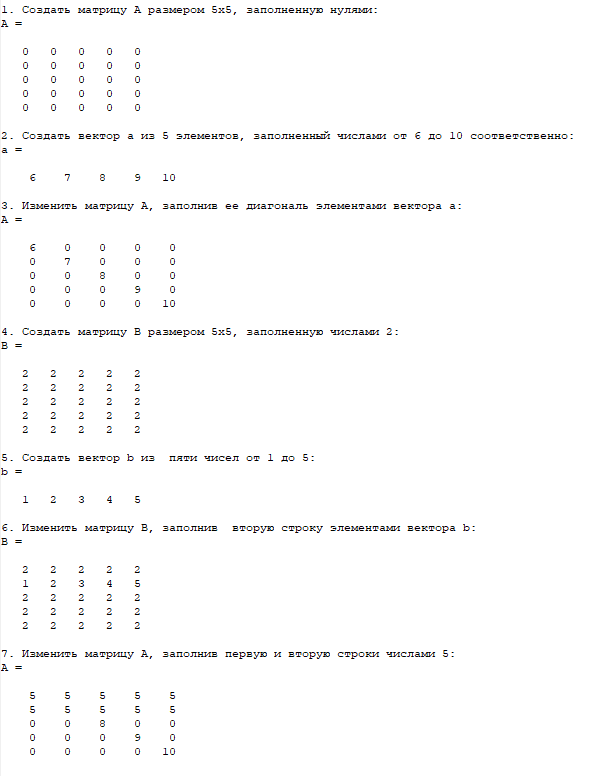
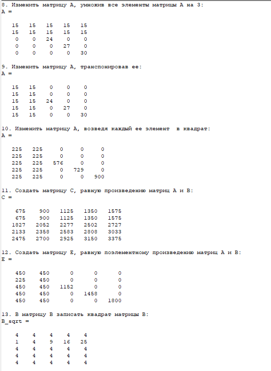
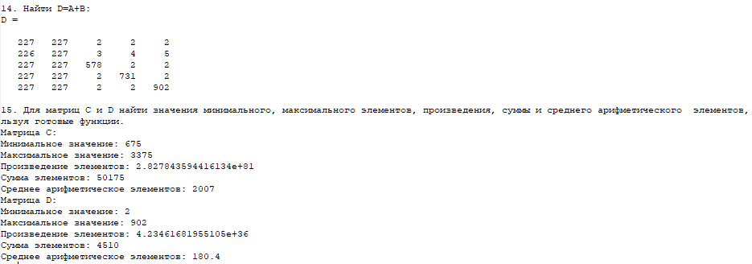
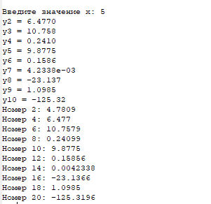

# Задача 1 Матрицы

### Задание:

Написать m-файл, в котором выполняются следующие операции

1. Создать матрицу А размером 5х5, заполненную нулями.
2. Создать вектор а из 5 элементов, заполненный числами от 6 до 10 соответственно.
3. Изменить матрицу А, заполнив ее диагональ элементами вектора а.
4. Создать матрицу В размером 5х5, заполненную числами 2.
5. Создать вектор b из  пяти чисел от 1 до 5
6. Изменить матрицу B, заполнив  вторую строку элементами вектора b.
7. Изменить матрицу А, заполнив первую и вторую строки числами 5
8. Изменить матрицу А, умножив все элементы матрицы А на 3.
9. Изменить матрицу А, транспонировав ее
10. Изменить матрицу А, возведя каждый ее элемент  в квадрат
11.Создать матрицу С, равную произведению матриц А и В
12. Создать матрицу E, равную поэлементному произведению матриц А и В
13. В матрицу B записать квадрат матрицы B
14. Найти D=A+B
15. Для матриц С и D найти значения минимального, максимального элементов, произведения, суммы и среднего арифметического  элементов, используя готовые функции. 

Результат каждой операции должен выводиться.

---------

Написать m-файл, в котором вводится значение переменной x 

вычисляются значения y по формулам, приведенным ниже, каждое из вычисленных значений должно выводиться на экран

### Результат:

[Код приложения для первого задания](main.m)

---------------

[Код приложения для второго задания](sub.m)

