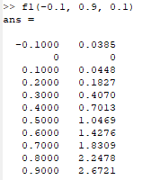

# Задача 2 Функции

### Задание:

Написать четыре m-файла, содержащих 4 функции. Каждая функция возвращает матрицу состоящую из двух столбцов: 1-й столбец со значениями x, 2-ой столбец со значениями f(x). В качестве параметров в функцию передаются границы диапазона a и b( x∈[a,b]) и шаг h. 

При демонстрации задания из командного окна вызвать эти функции с нужными параметрами (a, b, h)

Функции:

### Результат

[Код приложения](f1.m)

[Код приложения](f2.m)

[Код приложения](f3.m)

[Код приложения](f4.m)

