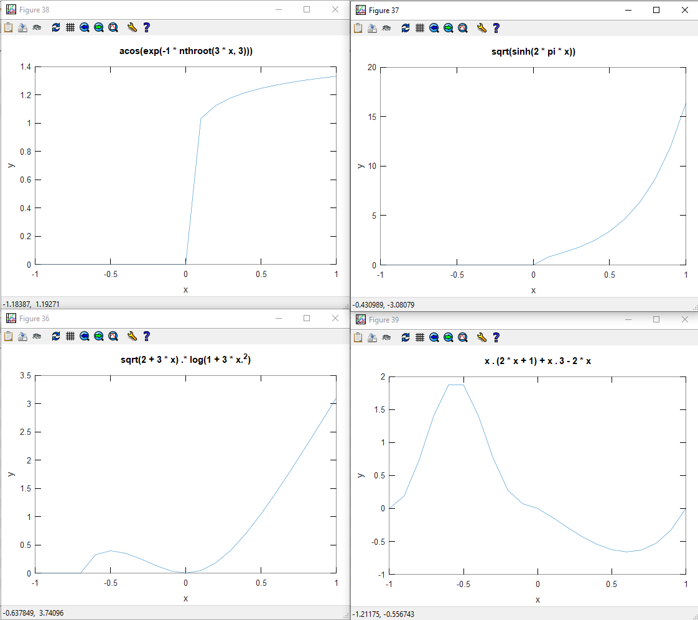
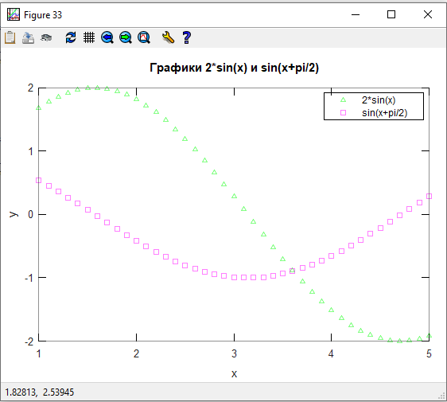
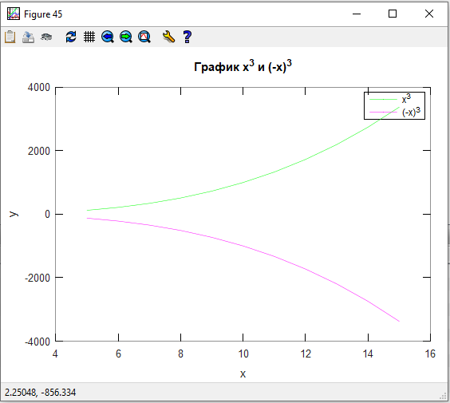
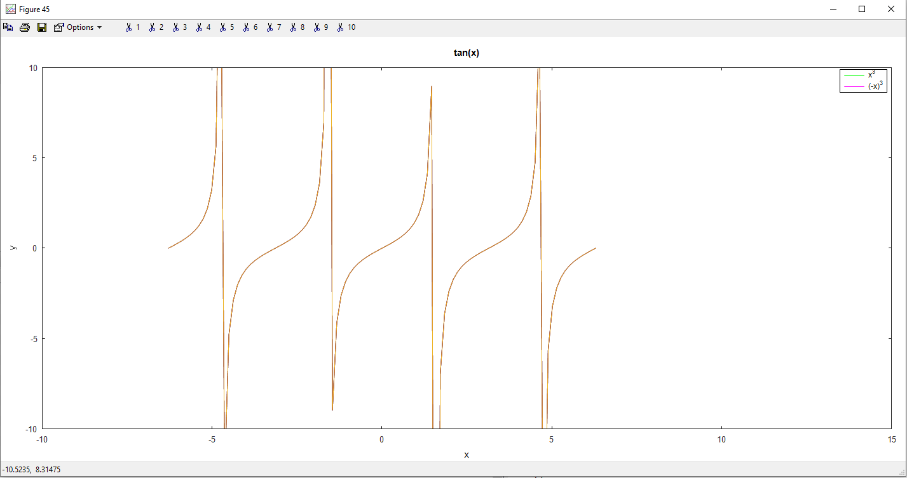

# Задание 3. Построение графиков

### Задание:

Построить графики (каждый график в отдельном окне) четырех функций, взятых из предыдущего задания, использовать функции написанные в задании 2.
Интервал для аргуметов и шаг подобрать для каждого графика таким образом, чтобы картинка была "красивой" и давала представление о поведении функции. 
Подписи по осям Ох и Oy должны быть обязательно. 

---------

Построить на одной плоскости графики двух функций: 2*sin(x) и sin(x+pi/2), константу pi использовать ту, которая имеется в octave. Диапазон значений x должен вводиться с клавиатуры и проверяться на корректность. Около каждого из графиков должна быть подпись, оси тоже должны подписываться.
График 1-й функции дожен быть зеленым, точки по котором он строится прорисовываться треугольниками.
График 2-й функции дожен быть фиолетовым, точки по котором он строится прорисовываться квадратами.

---------

Построить в одном окне, но на разных плоскостях графики функций x^3 (-x)^3. Диапазон значений x должен вводиться с клавиатуры и проверяться на корректность. Около каждого из графиков должна быть подпись, оси тоже должны подписываться. Графики должны отличаться цветом

---------

Построить график функции tg(x) на отрезке от -2* pi до 2* pi. Примечание: у функции есть точки разрыва, поэтому построение графика простым соединением точек линиями не подходит.

### Результат:

[Код приложения](work1.m)

[Код приложения](work2.m)

[Код приложения](work3.m)

[Код приложения](work4.m)

