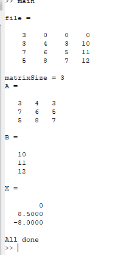
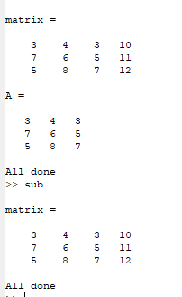

# Задание 4 Решение СЛАУ 

### Задание:

В файле записано n- количество переменных, элементы матрицы A и вектора B. Написать программу, которая считывает эти данные из файла и решает систему линейных уравнений AX=B, если решение существует. 

После окончания решения, проверить правильность ответа. Произведение AX должно быть равно вектору B.

---------

В файле записаны числа, предположительно коэффициенты для СЛАУ. В случае если файл заполнен без ошибок, то его содержимое похоже на файл из предыдущего задания, только без первой строки, содержащей кол-во уравнений. Необходимо:

* считать данные из файла
* проверить их на корректность (возможные ошибки: файл не существует, файл пустой, в строках разное кол-во чисел, кол-во строк не равно кол-ву элементов в строке+1, в файле помимо чисел содержатся данные другого типа, например, строки)
* решить СЛАУ, если возможно

Пример правильного ввода:

3 | 4 | 3 | 10

7 | 6 | 5 | 11

5 | 8 | 7 | 12

### Результат:

[Код приложения](main.m)

[Код приложения](sub.m)

